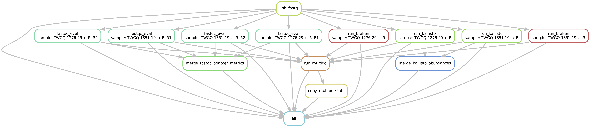

# BVI RNA-seq Pipeline

The following instructions outline running the RNA-seq analysis pipeline for the **maternal BVI** (bacterial, virus, and immune response) project. **Instructions are intended for those involved with the project at Washington University School of Medicine.** As such, instructions will be provided with the assumption processing will take place on WashU RIS `compute1` compute server using `storage1` and `scratch1` volumes.

# Prerequisites

The following prerequisite components are required for running the RNA-seq pipeline.

1. FASTQ (paired-read files)
2. Docker Image
3. Human Transcriptome Reference
4. Sample Key
5. Configuration File
6. Snakefile (Snakemake)

## 1. FASTQ (paired-read files)

The pipeline requires paired-end FASTQ files as input. You will supply the pipeline a file-of-filenames (fofn) listing the FASTQ files, one filename per line. Each FASTQ should have the fully qualified path to the file on disk listed. List all of the samples you wish to analyze in a `reads.fofn` file, the minimum being one FASTQ file. The path to the `reads.fofn` will be included in the pipeline `config.yaml` configuration file in the `reads fofn` field.

Example file in `example/reads.fofn` directory:

```plaintext
/example/HWFCGDSXX_GAATTCGT-GGCTCTGA_S25_L001_R1_001.fastq.gz
/example/HWFCGDSXX_GAATTCGT-GGCTCTGA_S25_L001_R2_001.fastq.gz
/example/AGCGATAG-AGGCGAAG_S1_R1_001.fastq.gz
/example/AGCGATAG-AGGCGAAG_S1_R2_001.fastq.gz
```

## 2. Docker Image

We will be using a predefined Docker image that contains all of the required software for the pipeline. The Docker image is available through DockerHub.

[twylie/bvi_rnaseq](https://hub.docker.com/r/twylie/bvi_rnaseq)

Currently, the Docker image contains:

+ FastQC
+ Kallisto
+ MultiQC
+ Python3
+ Pandas (Python)
+ Snakemake
+ graphviz

Note: The Docker image does not contain the required ancillary reference databases to run the pipeline. The database files are too large to include in the Docker image and will be hosted on `storage1` volumes.

## 3. Human Transcriptome Reference

We will need a human transcriptome reference for [Kallisto](https://pachterlab.github.io/kallisto/) pseudoalignments. The human transcriptome reference files are available here:

[Ensembl Database](https://www.ensembl.org/info/data/ftp/index.html)

The Kallisto authors recommend using cDNA fasta, specifically the `*.cdna.all.fa.gz` files. Kallisto can build indices directly from the gzipped files.

Example:

[http://ftp.ensembl.org/pub/release-103/fasta/homo_sapiens/cdna/Homo_sapiens.GRCh38.cdna.all.fa.gz](http://ftp.ensembl.org/pub/release-103/fasta/homo_sapiens/cdna/Homo_sapiens.GRCh38.cdna.all.fa.gz)

Once downloaded, we will need to index the transcriptome FASTA using Kallisto. Be sure to use the version of Kallisto in the `twylie/bvi_rnaseq` Docker Image. See [Kallisto Manual](https://pachterlab.github.io/kallisto/manual) for details on creating Kallisto indexes.

The example directory contains an example reference that has already been indexed. This example has been truncated to a single transcript (ENST00000276925.7) for testing purposes only.

```plaintext
example/transcripts.fa
example/transcripts.fa.ndx
```

## 4. Sample Key

We will be providing a sample key to the pipeline that associates FASTQ file paths to canonical ids. The file should be tab-delimited and contain the following three fields:

1. FASTQ Path: The fully qualified paths to the FASTQ files, which may be gzipped.
2. Canonical ID: The canonical sample ids associated with the FASTQ files. The canonical ids will be used throughout the pipeline to identify the samples.
3. Set ID: The associated set or batch ids for the samples.

The `example/sample_key.tsv` file provides an example sample key for reference.

```plaintext
FASTQ Path	Canonical ID	Set ID
/storage1/fs1/PTB/Active/twylieAnalysis/bviRNASeq/seq/set1/AGCGATAG-AGGCGAAG_S1_R1_001.fastq.gz	TWGQ-1276-29_c_R	1
/storage1/fs1/PTB/Active/twylieAnalysis/bviRNASeq/seq/set1/CTGAAGCT-TATAGCCT_S46_R2_001.fastq.gz	TWGQ-1502-12_a_R	1
/storage1/fs1/PTB/Active/twylieAnalysis/bviRNASeq/seq/set1/AGCGATAG-AGGCGAAG_S1_R2_001.fastq.gz	TWGQ-1276-29_c_R	1
/storage1/fs1/PTB/Active/twylieAnalysis/bviRNASeq/seq/set1/GAATTCGT-AGGCGAAG_S47_R1_001.fastq.gz	TWGQ-2217-20_b_R	1
/storage1/fs1/PTB/Active/twylieAnalysis/bviRNASeq/seq/set1/AGCGATAG-ATAGAGGC_S2_R1_001.fastq.gz	TWGQ-1504-20_b_R	1
/storage1/fs1/PTB/Active/twylieAnalysis/bviRNASeq/seq/set1/GAATTCGT-AGGCGAAG_S47_R2_001.fastq.gz	TWGQ-2217-20_b_R	1
/storage1/fs1/PTB/Active/twylieAnalysis/bviRNASeq/seq/set1/AGCGATAG-ATAGAGGC_S2_R2_001.fastq.gz	TWGQ-1504-20_b_R	1
/storage1/fs1/PTB/Active/twylieAnalysis/bviRNASeq/seq/set1/GAATTCGT-ATAGAGGC_S48_R1_001.fastq.gz	TWGQ-1295-24_b_R	1
/storage1/fs1/PTB/Active/twylieAnalysis/bviRNASeq/seq/set1/AGCGATAG-CAGGACGT_S3_R1_001.fastq.gz	TWGQ-1321-32_e_R	1
/storage1/fs1/PTB/Active/twylieAnalysis/bviRNASeq/seq/set1/GAATTCGT-ATAGAGGC_S48_R2_001.fastq.gz	TWGQ-1295-24_b_R	1
...
```

The `sample_key.tsv` file should be the superset of FASTQ/ids for a cohort---i.e. it should contain all of your FASTQ files and associated canonical ids.

## 5. Configuration File

We will be passing a small configuration file that provides ancillary information for running the pipeline. The configuration file should be formatted as [YAML](https://en.wikipedia.org/wiki/YAML). The configuration file will contain the following fields:

+ processing dir: Directory path to where the pipeline should write results.
+ reads fofn: Path to the file containing a list of FASTQ paths.
+ transcriptome ref: Path to the Kallisto indexed transcriptome reference file.
+ multiqc title: Title text for the MultiQC web report.
+ multiqc description: Description text for the MultiQC web report.
+ sample key: Path to the sample key file.

The `example/config.yaml` file provides an example sample key for reference.

```plaintext
processing directory: '/processing/bvi_rnaseq'
reads fofn: '/example/reads.fofn'
transcriptome ref: '/example/transcripts.fa.ndx'
multiqc title: 'BVI RNA-seq'
multiqc description: 'Initial metric review of sets #1 and #2.'
sample key: '/example/sample_key.tsv'
```

## 6. Snakefile (Snakemake)

We are using Snakemake to run our pipeline steps. A Snakefile (`bvi_rnaseq.smk`) contains the rules for running the pipeline steps. The Snakefile is static and will require no updating for running the pipeline. Currently, the pipeline involves the following rules/steps:

+ all
+ link_fastq
+ fastqc_eval
+ run_kallisto
+ run_multiqc
+ merge_kallisto_abundances
+ merge_fastqc_adapter_metrics
+ copy_multiqc_stats



The following example rulegraph shows the workflow for two samples. Note that FastQC works on FASTQ reads pairs separately while Kallisto maps using read-pair informtion per sample.


# Test Example

## Test Data

We may use the data provided in the `example/` directory to run a simple test using the pipeline. The following test files will be used:

```plaintext
example
├── AGCGATAG-AGGCGAAG_S1_R1_001.fastq.gz
├── AGCGATAG-AGGCGAAG_S1_R2_001.fastq.gz
├── HWFCGDSXX_GAATTCGT-GGCTCTGA_S25_L001_R1_001.fastq.gz
├── HWFCGDSXX_GAATTCGT-GGCTCTGA_S25_L001_R2_001.fastq.gz
├── config.yaml
├── reads.fofn
├── sample_key.tsv
└── transcripts.fa.ndx
```

NOTE: The files listed above are simulated data and are useful only for testing purposes.

## Test Commands

```zsh
# Download the required Docker image.
docker pull twylie/bvi_rnaseq

# Clone the GitHub repository.
git clone https://github.com/twylie/bviRNASeq.git
cd bviRNAseq/

# Run an interactive Docker container.
docker container run -it -v ${PWD}:/pwd -v ${PWD}/processing:/processing -v ${PWD}/example:/example twylie/bvi_rnaseq zsh
snakemake --configfile /example/config.yaml --snakefile /pwd/bvi_rnaseq.smk --cores 1 -p

# The output of the pipeline will be in the processing directory.
ls -ald /processing/bvi_rnaseq/*
```

The top-level report files of interest will be:

+ /processing/bvi_rnaseq/BVI-RNA-seq_multiqc_report.html
+ /processing/bvi_rnaseq/abundances.merged.tsv
+ /processing/bvi_rnaseq/adapters.merged.bin70-74.tsv
+ /processing/bvi_rnaseq/multiqc_general_stats.merged.tsv

# Running Real Data

Steps are outlined here for running real data through the pipeline. Instructions are written using WashU RIS computen services, namely `storage1`, `scratch1`, and `compute1`.

## 1. Log Into Washu RIS

This step requires both VPN and RIS compute accounts at Washington University.

First, authenticate using your VPN client (e.g. Cisco AnyConnect Client). Once VPN is running successfully, we will secure-shell into RIS remotely.

```zsh
ssh twylie@compute1-client-1.ris.wustl.edu
```

## 2. Setup the Processing Directory

Because of the cache layer on `compute1` we may experience I/O latency when reading and writng many files concurrently. Therefore, we will use the faster `scratch1` space for running and writing pipeline directive files, while writing larger output files to slower, larger `storage1` space.

Setup the `storage1` processing directory first.

```zsh
cd /storage1/fs1/PTB/Active/twylieAnalysis/bviRNASeq/analysisReview/
```

This will be the directory where we will be writing our analysis output from the pipeline. This directory already includes the Kallisto indexed version of the transcriptome.

```plaintext
transcriptome_reference/Homo_sapiens.GRCh38.cdna.all.fa
transcriptome_reference/Homo_sapiens.GRCh38.cdna.all.fa.fai
transcriptome_reference/Homo_sapiens.GRCh38.cdna.all.fa.index
```

We will make a results directory in this area for running the pipeline:

```zsh
mkdir /storage1/fs1/PTB/Active/twylieAnalysis/bviRNASeq/analysisReview/pipelineResults/
```

(To be continued...)
